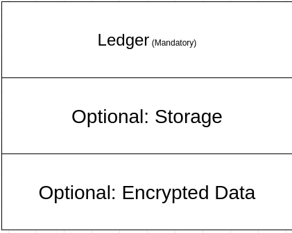

# Peerage

Peerage (pronounced peer-aazh not peer-age!) is a P2P communication and file sharing tool  with monetization abilities. The app is made of "rooms" and these rooms are customizable through HTML, CSS and JavaScript. But the room resides on your PC, not a server, and anyone who connect to your room accepts some of the load. Peers discover each othr through a ledger and muliicast DNS. Speaking of ledgers you can make your room VIP and have people who pay the token registered in the ledger to acces it. The token is not a cryptocurrency, it's not mined or anything, it's just, like, a representation for the other cryptocurrencies. You basically pay in crypto to buy this token and the token is in the ledger... you know, like NeoPets currency but P2P! I had originally written 'our token' but that's wrong, the token does not belong to anyone but the holder. This is entirely decentralized. You can do "other" things with this token too. The ledger is shared by all members, only one aspect of ledger is active (aka uncompressed) active at time. The other aspects are compressed.

As far as the network is concerned, I, being a hip young go-getter will use QUIC as the main transport. I will use come up with common discovery and multicast methods too. All these will be of my own implementation, although I might copy off libp2p like the loser that I am. But I won't use libp2p. I still have to plan the network side of thing, but it will siurely be planned by late this month.

So, every room has a ledger head, an storage middle, and a cryptographic end. Each of these sections are what make of a 'Rapid Tree' which I have explained below.

That is because we will have rooms that are just ledgers, but we will have rooms with storage, say an HTML page or something like that, or a music file, that that the ledger controls. For example, the ledger can control who has bought an item. 

Cryptographic data are for data that need to be hidden. This includes secret financial data or similar things. 

One thing ledger could control is the financial data, as in, if the rom is VIP, who hs paid for it with what crpto, etc.

The development on RapdiTree is onoing.

It's highly WIP. Any financial support during the development of this application is appreciated. Also you can do pull requests. 

## What I have made so for

### Peerage-Utils

This project contains all the utilities. Right now it hosts traits and this MASSIVE binary tool I have written. 

### Peerage-Hash

The custom hash that I am going to use all across the software. It's kinda slow curently but I will work on it to make it faster.

### Peerage-Coll

I need my RapidTree data to live on the stack(it allows me so much suff especially use of Copy). So I made peerage-coll.

A dynamic list, like any dynamic list, I am using Rust arrays to hold the dat and it can be turned into an iterator as well (nothing spectial, I just created an iterator wrapper and implemented IntoIter. I will implement from iter too but there's already a function for that). The dynamic list (which I call "collection") has a macro (`coll!`) too, just like vec.

The maximum length it can hold is `1024 * 16` but I don't need more than that, I doubt it will have more than 100 items.

### Peerage-RTree

This is Rapid Tree my custom data type for holding room data. It's extremely expansive, and I'm currently developig it. Once I'm done I will write about it in its own folder.

### Peerage-Macros

The necessary proc macros.

### Peerage-Holder

This is a holder enum, a bit like Option, a bit like Box. I need to rework it a bit. It can be used to hold several types into one type.

Explanation for the rest coming.
